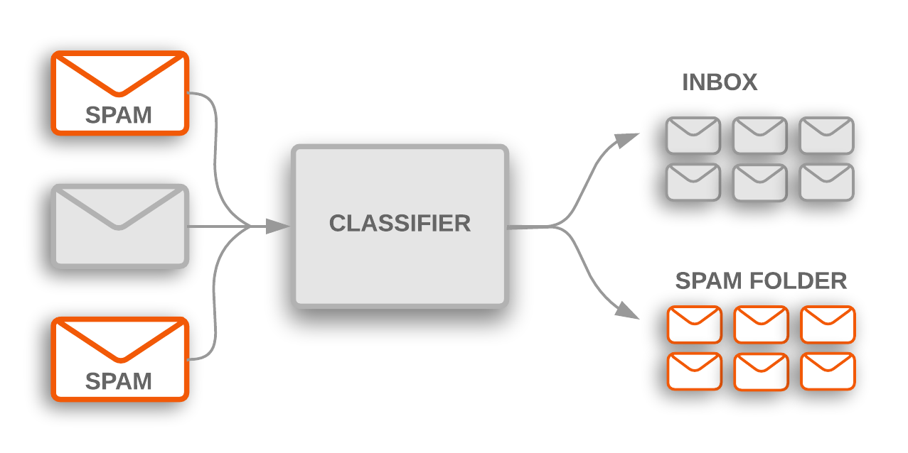
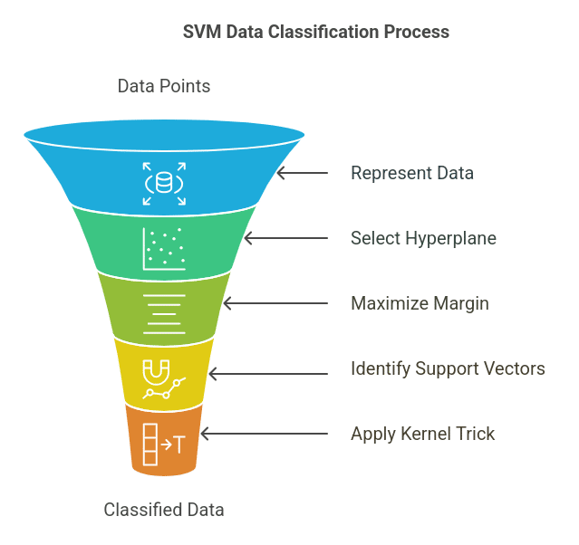

# Advanced-Statistical-Learning-Semester-Project
Final project for the advanced statistical learning class of 2025-2026.

# SMS Spam Classification using Machine Learning - PYTHON -

This repository contains **machine learning pipeline** for detecting spam text messages (SMS).  
It demonstrates **text preprocessing**, **TF-IDF vectorization**, **model selection**, and **resampling-based evaluation** (cross-validation and ROC/PR analysis) using Python.

---

## Introduction

Spam filtering is a classic **binary classification** problem in Natural Language Processing (NLP).  
Here, we build and compare several models to classify messages as **ham (legitimate)** or **spam (unwanted)**:

- **Logistic Regression** (with L1/L2 regularization)  
- **Linear SVM** (with and without probability calibration)  
- **Random Forest** (as a non-linear baseline)

Each model is tuned with **5-fold cross-validation**, then evaluated on a held-out test set.  
Performance is visualized using **confusion matrices**, **ROC/PR curves**, and summary tables (AUC, AP).




---

## the Dataset

The project uses the [**SMS Spam Collection Dataset**](https://archive.ics.uci.edu/ml/datasets/SMS+Spam+Collection)  
from the UCI Machine Learning Repository.

- **Size:** 5,574 messages  
- **Classes:** `ham` (≈86%) and `spam` (≈14%)  
- **Format:** tab-separated file with columns: `label`, `text`

If the dataset is not present locally, it will be **automatically downloaded** by the script.


## Features

- TF–IDF text features with multiple classifiers:
  - Logistic Regression  
  - Linear SVM  
  - Calibrated Linear SVM  
  - Random Forest
- Holdout metrics (Accuracy, F1, ROC AUC, PR AUC)
- Bootstrap confidence intervals (test-set and refit bootstraps)
- LDA/QDA 2-D projections (with optional SMOTE resampling)
- One-command setup and execution

---

## Prerequisites

- **Git**
- **Mamba / Conda** (recommended: [Miniforge](https://github.com/conda-forge/miniforge))
- **Python 3.10–3.11**

> If you don’t have mamba, replace `mamba` with `conda` in all commands below.

---

## Quick Start (one command)

From the repo root, simply run:

```bash
chmod +x scripts/setup_and_run.sh
bash scripts/setup_and_run.sh
```
Confusion Matrices for LDA and QDA analysis are produced by utilising the following code.
```bash
python lda_qda_confmats.py
```
## Manual Setup if necassary

### Create & activate the environment
```bash
mamba env create -f environement-requirements.yml
mamba activate advanced-statistical-learning    
```
### If you prefer pip:
```bash    
python -m venv .venv    
source .venv/bin/activate    
pip install -r requirements.txt
```
### Install project locally 
```bash
pip install -e 
```
### Enable SMOTE visualizations
```bash
pip install imbalanced-learn
```
